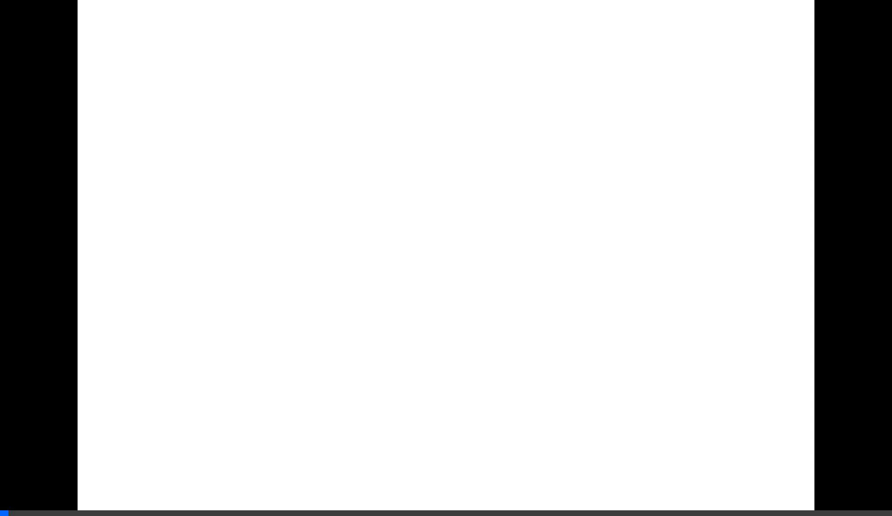

# Omkarnath Dubey | Frontend Developer Portfolio



<div align="center">

[](https://www.php.net/)
[](https://sass-lang.com/)
[](./LICENSE)

**[View Live Demo](#)** • **[Contact Me](mailto:omkarnath@example.com)**

</div>

---

## 🚀 Overview

A premium, corporate-style personal portfolio website designed for a senior **Frontend Developer**. Built with a focus on performance, scalability, and clean architecture, this project utilizes a lightweight stack to deliver a high-end experience without the bloat.

The design philosophy emphasizes **modern UI**, **clean layouts**, and **subtle interactions**, reflecting a professional and results-driven persona.

## 🛠 Tech Stack

- **Backend**: Native PHP 8+ (No heavy frameworks)
- **Data**: JSON for content content & SQLite for form handling
- **Frontend**: HTML5, SCSS (Sass), Vanilla JavaScript ES6+
- **Typography**: 'Inter' & 'Outfit' (Google Fonts)
- **Icons**: Custom CSS/SVG components

## ✨ Key Features

- **🎨 Corporate Aesthetic**: Dark theme with refined color palette (Charcoal, Navy, Slate).
- **⚡️ Blazing Fast**: Zero client-side framework bloat.
- **📱 Fully Responsive**: Optimized for Mobile, Tablet, and Desktop.
- **📄 Data-Driven**: All text content is separated in `data/content.json` for easy editing.
- **📩 Functional Contact Form**: Submissions are securely stored in a local SQLite database.
- **✨ Smooth Interactions**: Sticky navigation, scroll-reveal animations, and micro-interactions.

## 📂 Project Structure

```bash
Portfolio/
├── assets/
│   ├── scss/       # Source styles (Sass)
│   ├── css/        # Compiled CSS
│   ├── js/         # Vanilla JavaScript
│   └── images/     # Assets
├── data/
│   ├── content.json    # Editable site content
│   └── database.sqlite # Contact form messages
├── includes/       # PHP Partials (Header, Footer)
├── index.php       # Main Entry Point
└── README.md       # Docs
```

## 🚀 Getting Started

### Prerequisites

- PHP 7.4 or higher
- Node.js (for SCSS compilation only)

### Installation

1. **Clone the repository**
   ```bash
   git clone https://github.com/Ohom1/Portfolio.git
   cd Portfolio
   ```

2. **Install Dependencies (for Sass)**
   ```bash
   npm install
   ```

3. **Compile SCSS**
   ```bash
   npm run sass
   ```
   *(Or run `npx sass assets/scss/main.scss assets/css/main.css` directly)*

4. **Start the Development Server**
   ```bash
   php -S localhost:8000
   ```

5. **Visit the site**
   Open [http://localhost:8000](http://localhost:8000) in your browser.

## 📝 Customization

- **Edit Content**: Modify `data/content.json` to update text, projects, and skills.
- **Styles**: Tweak variables in `assets/scss/partials/_variables.scss`.

## 📄 License

This project is licensed under the MIT License - see the [LICENSE](LICENSE) file for details.

---

<div align="center">
  <sub>Built with ❤️ by Omkarnath Dubey</sub>
</div>
